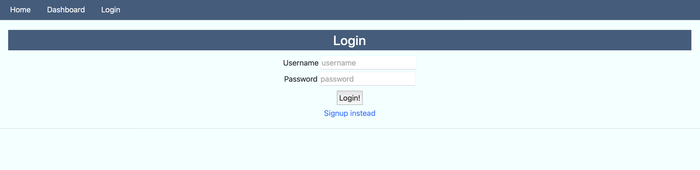
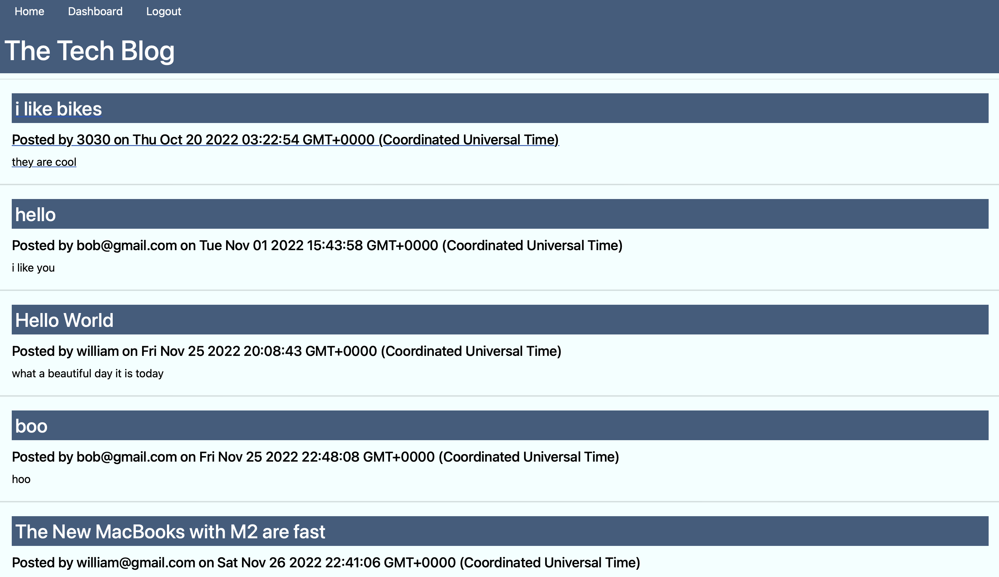
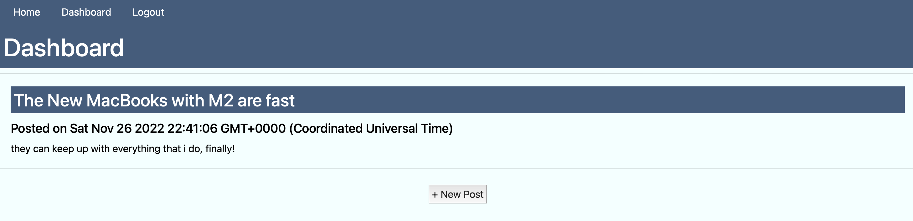
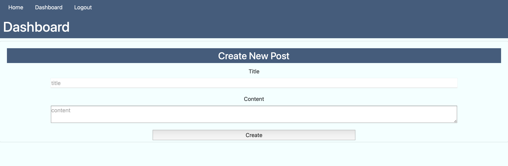
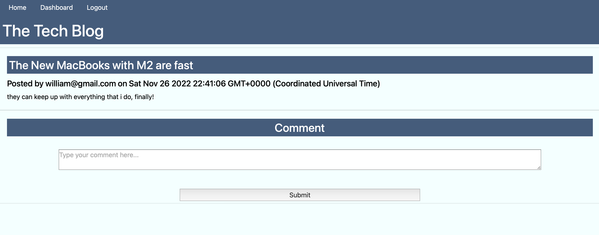

## Table of Contents
---
* [Description](#description)
* [Packages](#packages)
* [Usage](#usage)
* [Screenshots](#screenshots)
* [License](#license)

## Description
---
This project is a basic blog site for people who want to discuss tech related topics. The motivation for this project was to create a blog where anyone can share their thoughts, opinions, and links about tech. The site has uses usernames with a password, to be able to post and comment you must create a profile.  You are also able to change or delete post from your dashboard page.  If you click on a post that isn't yours you can see comments or leave one yourself.  To view this project deployed, click [here](https://challenge14techblogg.herokuapp.com/signup).

## Packages
---
Technologies Used: 
- Javascript
- Node.js
- Heroku 
- Insomnia

NPM:
- mysql2 
- express
- express-handlebars
- express-session
- sequelize 
- connect-session-sequelize
- dotenv
- nodemon 

## Usage
---
To see the site in action click on the [link](https://challenge14techblogg.herokuapp.com/signup).  Create a user profile and see posts and comments from other users.  You can also make your own post and delete it later.

### **Screenshots**

## License
MIT License

Copyright (c) 2022 illtron3030.

Permission is hereby granted, free of charge, to any person obtaining a copy 
of this software and associated documentation files (the "Software"), to deal
in the Software without restriction, including without limitation the rights
to use, copy, modify, merge, publish, distribute, sublicense, and/or sell
copies of the Software, and to permit persons to whom the Software is
furnished to do so, subject to the following conditions:

The above copyright notice and this permission notice shall be included in all
copies or substantial portions of the Software.

THE SOFTWARE IS PROVIDED "AS IS", WITHOUT WARRANTY OF ANY KIND, EXPRESS OR
IMPLIED, INCLUDING BUT NOT LIMITED TO THE WARRANTIES OF MERCHANTABILITY,
FITNESS FOR A PARTICULAR PURPOSE AND NONINFRINGEMENT. IN NO EVENT SHALL THE
AUTHORS OR COPYRIGHT HOLDERS BE LIABLE FOR ANY CLAIM, DAMAGES OR OTHER
LIABILITY, WHETHER IN AN ACTION OF CONTRACT, TORT OR OTHERWISE, ARISING FROM,
OUT OF OR IN CONNECTION WITH THE SOFTWARE OR THE USE OR OTHER DEALINGS IN THE
SOFTWARE.

--- 